diya 팀이 작업한 CartoonGAN을 받아서 시험삼아 돌려보는 중입니다.

일단 anime 이미지가 필요합니다. 이렇게 하면 1초에 한 프레임씩 이미지를 추출해서 저장합니다.

ffmpeg.exe -i d:\download\your-name\Kimi.mkv -vf fps=1 img%05d.jpg

flickr에서 flickr8k 이미지를 다운로드합니다.

https://www.kaggle.com/adityajn105/flickr8k/activity
이 페이지에 가면,

요 페이지에서 다운로드 합니다.

이런식으로 저장해 두고


preprocessing.py를 실행합니다.
preprocessing.py를 pycharm에서 실행하기 위하여 아래와 같이 수정했습니다
```
    main('photo', 'D:/uni-trend/kimino/photosrc/images', 'D:/uni-trend/kimino/photodat', 'D:/uni-trend/kimino/animesrc/images', 'D:/uni-trend/kimino/animedat', 'D:/uni-trend/kimino/animedge')
    main('animation', 'D:/uni-trend/kimino/photosrc/images', 'D:/uni-trend/kimino/photodat', 'D:/uni-trend/kimino/animesrc/images', 'D:/uni-trend/kimino/animedat', 'D:/uni-trend/kimino/animedge')
```

```
def main(image_type_to_process, photosrc, photodat, animesrc, animedat, animedge):
```

```
    args = parser.parse_args()
    args.photo_image_source_path = photosrc
    args.photo_image_save_path = photodat
    args.animation_image_source_path = animesrc
    args.animation_image_save_path = animedat
    args.animation_edge_smoothed_save_path = animedge
    args.image_type_to_process = image_type_to_process
```

실행 결과. 밝은 다리의 이미지는 비슷한데, 계곡 풍경은 매우 어둡습니다.
원인은 모르겠군요. ㅎㅎㅎ

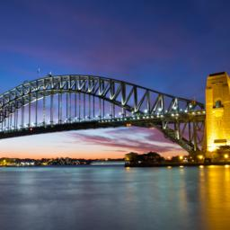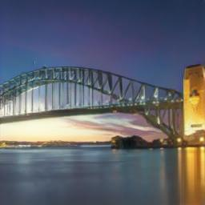<br>
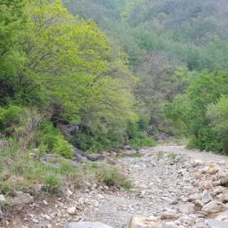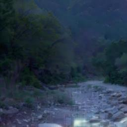<br>
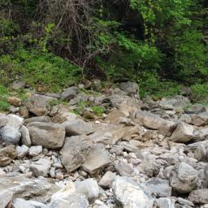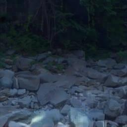<br>
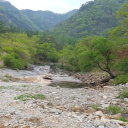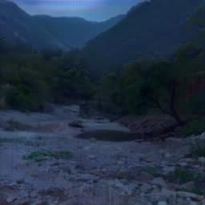<br>

여기까지 살펴본 결과로는 CartoonGAN은 조금 부족하지 않은가 싶습니다.

그래서 Original CartoonGAN을 돌려보았습니다.<br>
결과는 아래와 같습니다.<br>
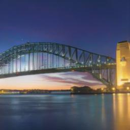<br>
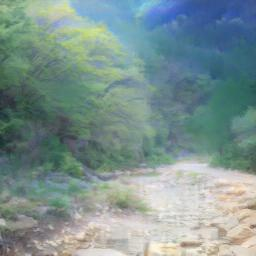<br>
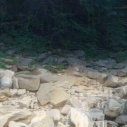<br>
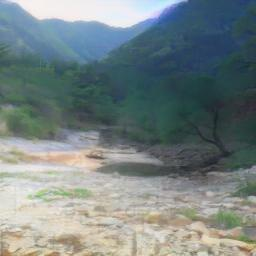<br>
이 결과가 더 좋습니다. 원인은 모르겠습니다.<br>

<a href="https://drive.google.com/file/d/18k1dxBnQk_A3g2xrub6Ln6Om0JjyTS8N/view?usp=sharing">Original CartoonGAN checkpoint download</a>

### Below is DIYA team's ORIGINAL README.md

# [CartoonGAN](http://openaccess.thecvf.com/content_cvpr_2018/papers/Chen_CartoonGAN_Generative_Adversarial_CVPR_2018_paper.pdf)

Contributors (code): [문지환](https://github.com/mnmjh1215), [윤준석](https://github.com/kokookok77)

Contributors (presentation): [문지환](https://github.com/mnmjh1215), [윤준석](https://github.com/kokookok77), [박수현](https://github.com/suhyunS2), [이유재](https://github.com/yujaelee), [주윤하](https://github.com/YoonHaJoo)

Project for DIYA Meet-up at Aug 4, 2019.

## Goals of this project

1. Implement CartoonGAN and train/test with our data
2. Compare CartoonGAN and CycleGAN
3. Add some components of CartoonGAN to CycleGAN, such as edge smoothed data, and see if image quality improves
4. Further improve CartoonGAN

## Result

[Presentation](./images/DIYA-meet-up-CV_2019-08-04.pdf) (in Korean)

According to FID, CartoonGAN is better than CycleGAN, and our modified CartoonGAN is the best. (FID is smaller if two sets of images are similar)

|                           | CycleGAN | CartoonGAN | CartoonGAN-modified |
|---------------------------|----------|------------|---------------------|
| FID with animation images | 108.69   | 100.30     | 95.50               |
| FID with photo images     | 76.13    | 80.96      | 81.91               |

Results of modified CycleGANs are not presented, because they showed little improvement.

### Comparison of Generated Images

These are comparison of images generated by CartoonGAN-modified and CartoonGAN. Images generated by CartoonGAN-modified are less blurry and less dark in general.


### Images Generated by Our Modified CartoonGAN

Here, we only present images generated with our modified, improved CartoonGAN.


...and some worse generated images...


Special thanks to [ML2](https://github.com/kc-ml2) for financial support
